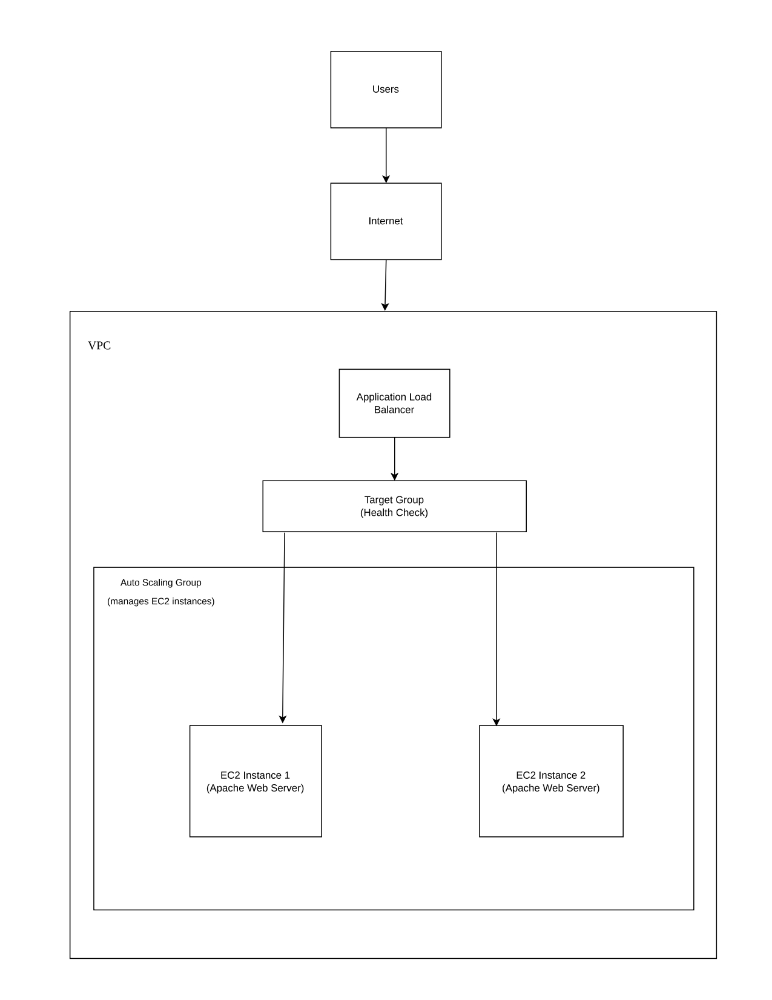
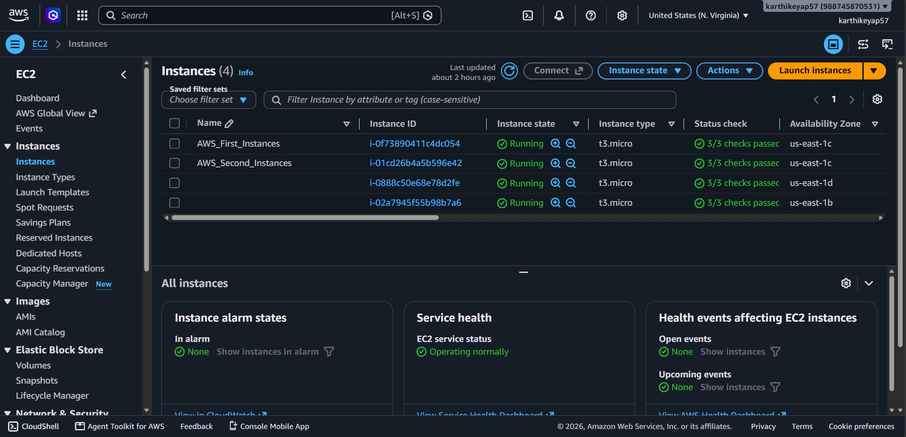
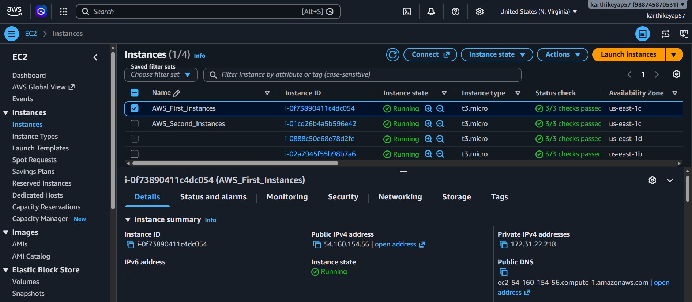
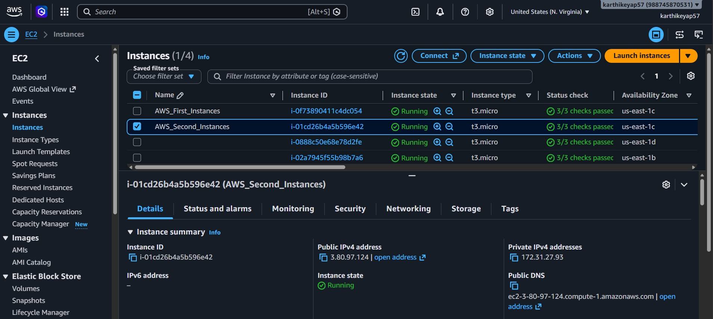
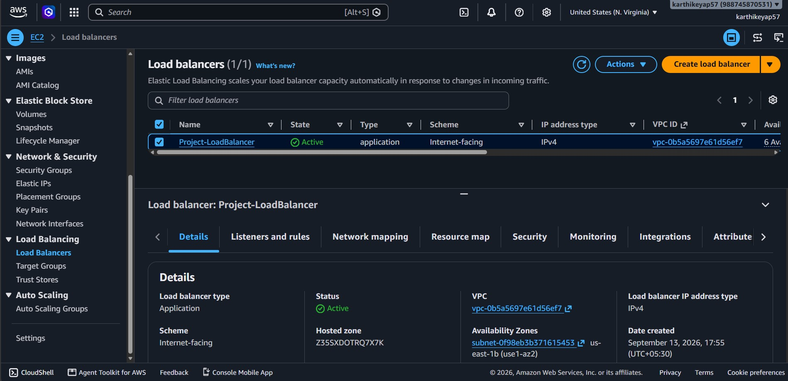
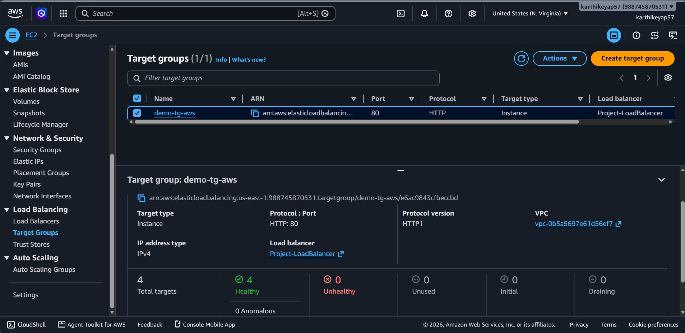
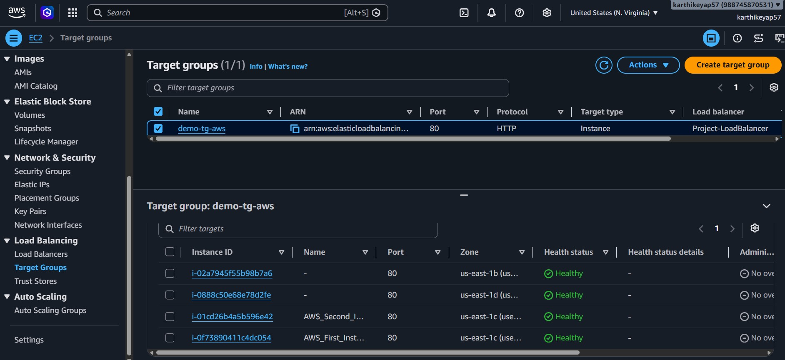
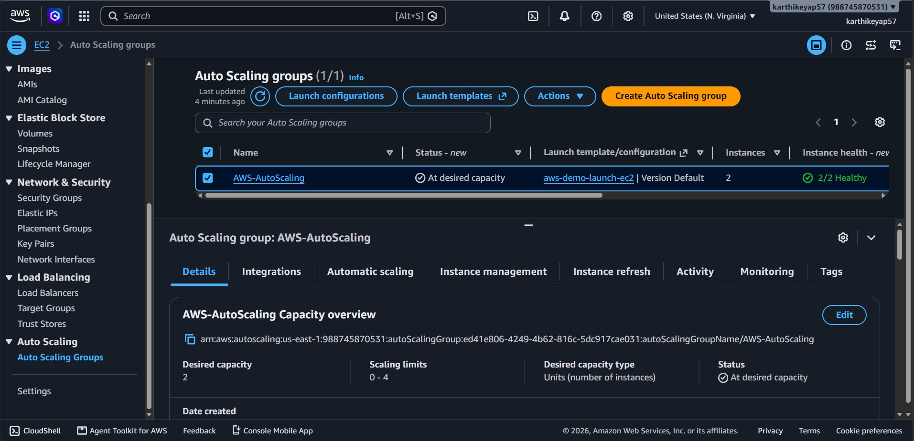
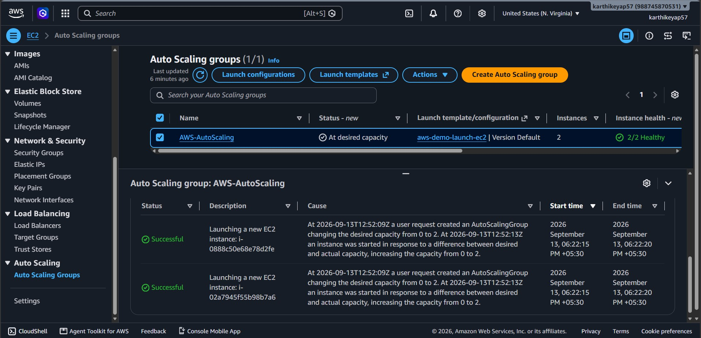
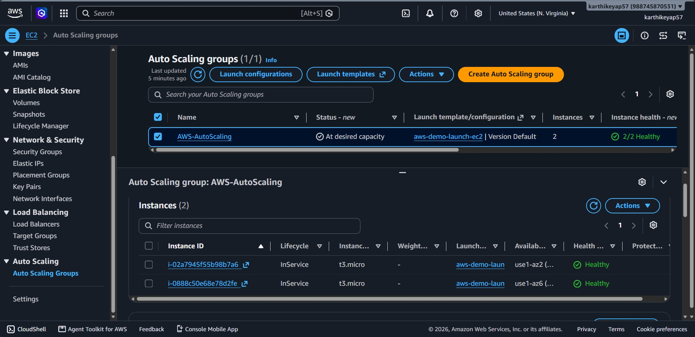

# Highly Available Web Application Deployment on AWS using Application Load Balancer \& Auto Scaling

## Project Overview

This project demonstrates the deployment of a highly available web application on AWS using Amazon EC2, an Application Load Balancer (ALB), a Target Group, and an Auto Scaling Group (ASG).

The web application is hosted on Apache Web Server running on Linux-based Amazon EC2 instances.

The Application Load Balancer receives incoming HTTP traffic and forwards requests to healthy EC2 instances registered with the Target Group.

The Auto Scaling Group manages the EC2 instances according to the configured capacity.

EC2 User Data is used to automatically install and configure the Apache Web Server when an EC2 instance is launched.


## Architecture



### Request Flow

**Users → Internet → Application Load Balancer → Target Group → EC2 Instances**

The **Auto Scaling Group manages the EC2 instances** behind the Target Group.


## AWS Services \& Technologies Used

* Amazon EC2
* Application Load Balancer (ALB)
* Target Groups
* Auto Scaling Groups (ASG)
* Amazon VPC
* Security Groups
* Apache HTTP Server
* Linux
* Shell Scripting
* EC2 User Data
* AWS Management Console


## Deployment Process

### 1\. Launch EC2 Instances

Linux-based Amazon EC2 instances were launched to host the web application.

### 2\. Configure Apache Web Server

Apache HTTP Server was installed and configured using EC2 User Data.

The User Data script:

* Updates system packages
* Installs Apache HTTP Server
* Enables Apache at system startup
* Starts the Apache service
* Creates a basic HTML web page

### 3\. Create Target Group

A Target Group was created for the EC2 web servers.

Health checks were configured to verify the availability of the registered EC2 instances.

### 4\. Configure Application Load Balancer

An internet-facing Application Load Balancer was created.

The ALB listens for HTTP requests and forwards traffic to the registered targets in the Target Group.

### 5\. Configure Auto Scaling Group

An Auto Scaling Group was configured to manage the EC2 instances.

The desired capacity was configured as **2 instances**.

The Auto Scaling Group successfully launched and managed the required EC2 instances.

### 6\. Connect Auto Scaling Group with Target Group

The Auto Scaling Group was associated with the Target Group so that instances launched by the ASG could be registered with the load balancer.


## EC2 User Data

The following User Data script was used to configure the Apache web server:

```bash
#!/bin/bash

# Update system packages
yum update -y

# Install Apache Web Server
yum install -y httpd

# Enable and start Apache
systemctl enable httpd
systemctl start httpd

echo "<h1>Hello World from $(hostname -f)</h1>" > /var/www/html/index.html
```

The use of `$(hostname -f)` allows the web page to display the hostname of the EC2 instance serving the request.

The complete script is also available in `scripts/user-data.sh`.


## How the Application Works

When a user accesses the Application Load Balancer DNS name:

1. The request reaches the Application Load Balancer.
2. The ALB forwards the request to the Target Group.
3. The Target Group routes the request to a healthy EC2 instance.
4. Apache processes the HTTP request.
5. The web page is returned to the user.

The Auto Scaling Group manages the EC2 instances behind the load balancer.


## Testing \& Validation

The deployment was validated using the AWS Management Console.

### EC2 Instances

The EC2 instances were successfully launched and their system status checks passed.



### First EC2 Instance



### First Instance Public IP


### Second EC2 Instance



### Second Instance Public IP


### Application Load Balancer

The Application Load Balancer was successfully created and verified as active.



### ALB DNS Validation

The application was successfully accessed through the Application Load Balancer DNS name.


### Target Group

The Target Group was configured with the EC2 instances.



### Target Group Health

The registered targets were successfully reporting healthy status.



### Auto Scaling Group

The Auto Scaling Group successfully reached its configured desired capacity of **2 instances**.



### Auto Scaling Activity

The Auto Scaling Activity History was used to verify successful EC2 instance launches.



### Auto Scaling Instances

The instances managed by the Auto Scaling Group were verified as healthy and in service.




## Validation Results

|Validation|Result|
|-|-|
|EC2 instances launched|Successful|
|EC2 status checks|Passed|
|Apache Web Server|Running|
|Target Group configuration|Successful|
|Target health checks|Healthy|
|Application Load Balancer|Active|
|ALB DNS accessibility|Successful|
|Auto Scaling Group|Configured|
|Desired capacity|2|
|ASG instance launches|Successful|
|ASG-managed instances|Healthy / In Service|


## Key Features

* Highly available web application architecture
* Application Load Balancer for HTTP traffic distribution
* Target Group health checks
* Auto Scaling for EC2 instance management
* Automated Apache installation using EC2 User Data
* Linux-based web server deployment
* Security Groups for network access control
* Health-based traffic routing
* Automated EC2 web-server configuration


## Project Outcome

The project successfully demonstrates how to deploy a web application on Amazon EC2 and improve its availability using an Application Load Balancer and Auto Scaling Group.

The deployment was validated through:

* Running EC2 instances
* Successful EC2 status checks
* Healthy Target Group targets
* Active Application Load Balancer
* Successful access through the ALB DNS name
* Successful Auto Scaling instance launches
* Healthy instances managed by the Auto Scaling Group

This project provides practical hands-on experience with AWS compute, networking, load balancing, health checks, instance automation, and Auto Scaling.


## Project Structure

```text
aws-alb-auto-scaling-web-app/
│
├── README.md
├── .gitignore
│
├── architecture/
│   └── architecture-diagram.png
│
├── scripts/
│   └── user-data.sh
│
└── Screenshots/
    ├── 01-ec2-instances.png
    ├── 02-first-instance.png
    ├── 03-first-instance-public-ip.png
    ├── 04-second-instance.png
    ├── 05-second-instance-public-ip.png
    ├── 06-load-balancer.png
    ├── 07-load-balancer-dns.png
    ├── 08-load-balancer-dns-2.png
    ├── 09-target-groups.png
    ├── 10-target-groups-healthy.png
    ├── 11-auto-scaling-group.png
    ├── 12-auto-scaling-activity.png
    └── 13-auto-scaling-instances.png
```


## Security

No AWS credentials, access keys, passwords, or private SSH keys should be included in this repository.

Private key files such as `.pem` files should never be committed to GitHub.

The `.gitignore` file is used to help prevent sensitive files from being accidentally tracked by Git.


## Author

**Karthikeya Puligadda**

**Cloud \& DevOps Enthusiast**


